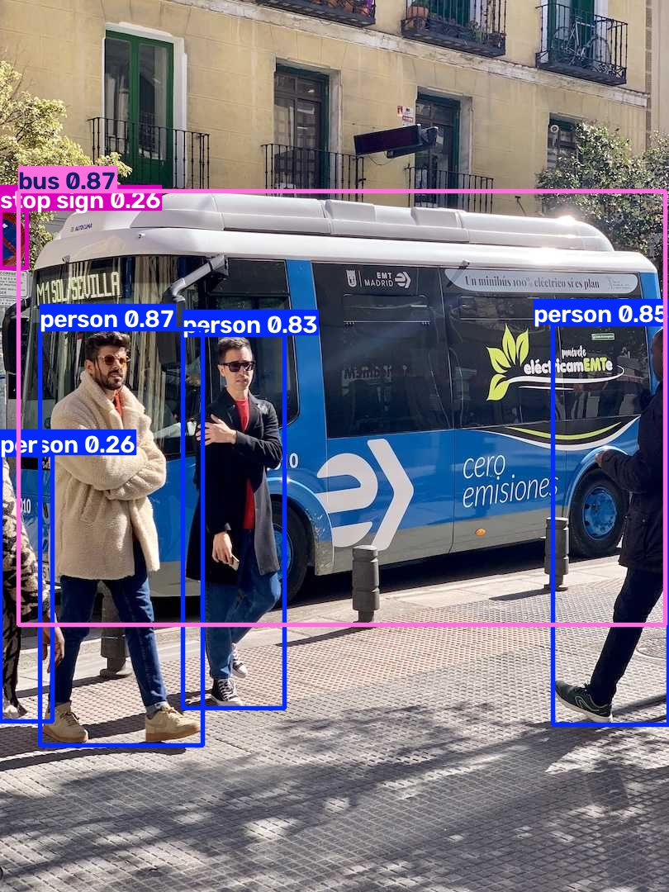

# 🧠 Object Detection using YOLOv8

A simple Object Detection project built using **YOLOv8**, **OpenCV**, and **Python**. The model detects objects in an input image, draws bounding boxes around them, and displays the detected object names with confidence scores.

---

## 📌 Features

- Detects multiple objects in an image
- Uses the pretrained YOLOv8 Nano model
- Draws bounding boxes automatically
- Displays object labels and confidence scores
- Easy to customize for different images

---

## 🛠️ Tech Stack

- Python
- YOLOv8 (Ultralytics)
- OpenCV
- Matplotlib
- PyTorch

---

## 📁 Project Structure

```
ObjectDetector/
│
├── images/
│   └── dog.jpg
│
├── detect.py
├── requirements.txt
└── README.md
```

---

## ⚙️ Installation

### 1. Clone the repository

```bash
git clone <repository-url>
cd ObjectDetector
```

### 2. Create a virtual environment

```bash
python -m venv venv
```

Activate it:

**Windows**

```bash
venv\Scripts\activate
```

**Linux / macOS**

```bash
source venv/bin/activate
```

### 3. Install dependencies

```bash
pip install ultralytics opencv-python matplotlib
```

---

## ▶️ Run the Project

Place an image inside the `images` folder.

Example:

```
images/
    dog.jpg
```

Run:

```bash
python detect.py
```

The first execution will automatically download the pretrained **YOLOv8 Nano** model (`yolov8n.pt`).

---

## 📸 Sample Output

The program detects objects in the image and displays:

- Bounding Boxes
- Object Labels
- Confidence Scores

Example:

```
Person 98%
Dog 97%
Car 95%
Bottle 91%
```

---

## 📚 Concepts Used

- Computer Vision
- Deep Learning
- Object Detection
- Bounding Boxes
- Confidence Scores
- Image Processing

---

## 🚀 Future Improvements

- Real-time webcam object detection
- Video object detection
- Object counting
- Streamlit web application
- FastAPI deployment
- AI-powered image description using LangChain and Ollama

## Results

### Input Image


### Detection Output



---

## 👩‍💻 Author

Garima

Learning AI Engineering through hands-on projects.